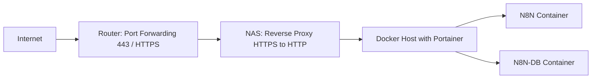

# N8N Deployment Guide for your NAS 

Deploy N8N (workflow automation) on Synology NAS using Portainer and Docker Compose with reverse proxy configuration.



## 📋 Prerequisites

- **DSM 7.0+** with Docker package installed
- **Portainer running** (from Package Center or Docker)
- **2GB+ RAM available** and 5GB+ storage
- **DDNS/domain configured** (e.g., `yourname.synology.me`)
- **SSL certificate** (Let's Encrypt via DSM)

## 🚀 Quick Setup

### 1. Create Directories
Create on your NAS: `/volume1/docker/n8n/` with subfolders `db`, `data`, `files`

### 2. Configure Environment
Update your `.env` file with secure passwords:
```env
POSTGRES_PASSWORD=your_secure_password
N8N_HOST=your-domain.synology.me
N8N_EXTERNAL_PORT= #e.g. 443
N8N_AUTH_USER=admin
N8N_AUTH_PASSWORD=your_admin_password
TIMEZONE=Europe/Berlin
```

### 3. Deploy in Portainer
1. **Stacks** → **Add Stack** → name: `n8n-production`
2. **Paste Docker Compose** content from the artifact
3. **Load .env file** in Environment variables section
4. **Deploy stack**

### 4. Configure Synology Reverse Proxy
**Control Panel** → **Application Portal** → **Reverse Proxy** → **Create**

```
Source: HTTPS, your-domain.synology.me:4043
Destination: HTTP, localhost:5678
```

**Advanced Settings:**
- **Proxy HTTP version:** Set to HTTP/1.1 to enable WebSocket support
- **No custom headers needed** - N8N_TRUST_PROXY=true handles this

### 5. Router Port Forwarding
Forward HTTPS port (e.g. 443) to your NAS IP address

## ✅ Access N8N
- **External:** `https://your-domain.synology.me:4043`
- **Internal:** `http://nas-ip:5678`

## 🛠️ Troubleshooting

### Portainer "Update Stack" Greyed Out
- **Check YAML syntax** with online validator
- **Verify all .env variables** are defined
- **Refresh browser** and try again

### N8N Not Accessible
1. **Check containers running** in Portainer
2. **Verify WebSocket enabled** in reverse proxy
3. **Test internal access** first: `http://nas-ip:5678` (if 5678 is used)

### Database Issues
- **Check database container logs** in Portainer
- **Verify .env credentials** match between services
- **Fix permissions:** `sudo chown -R 1000:1000 /volume1/docker/n8n/`

## 🔧 Key Corrections from Original Setup

### Reverse Proxy Headers
- **Custom headers NOT required** - N8N_TRUST_PROXY=true handles this
- **Only WebSocket support needed** in Advanced Settings
- **Simpler configuration** works better than complex header setup

### Security Notes
- **Change default passwords** in .env file
- **Never commit .env** to version control
- **Use strong SSL certificates**

---

**Need help?** Check Portainer container logs for specific errors.
